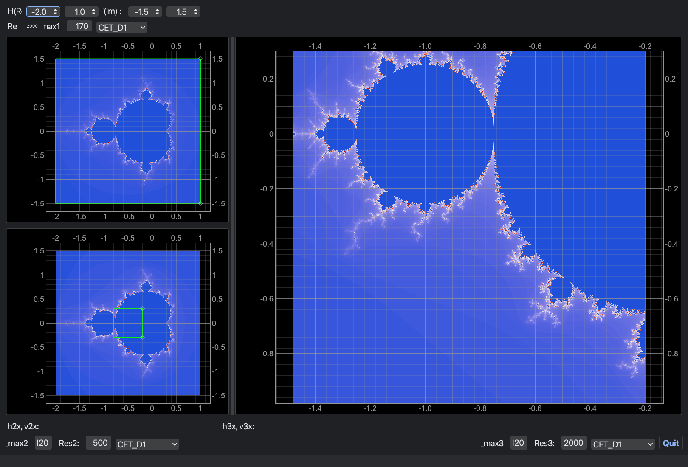

# Mandelbrot Viewer / マンデルブロ集合ビューア

An interactive Mandelbrot set explorer with three linked plots that
progressively zoom into the set. Built with **PySide6** + **pyqtgraph**, with
the set computed by a **Numba**-accelerated kernel and coordinates kept in
high precision with Python's `decimal.Decimal`.

3 つの連動するプロットでマンデルブロ集合を段階的に拡大表示する、対話的な
ビューアです。GUI は **PySide6** + **pyqtgraph**、集合の計算は **Numba** で
JIT/並列化し、座標は `decimal.Decimal` により高精度で保持します。



GW1 (左上/top-left): 全体表示 + ROI1 / GW2 (左下/bottom-left): ROI1 拡大 + ROI2 /
GW3 (右/right): ROI2 拡大

## Features / 特徴

- **Three linked views / 3 連動ビュー**
  - **GW1** (top-left / 左上): overview of the whole set with a movable ROI.
    全体表示と、移動・リサイズできる ROI1。
  - **GW2** (bottom-left / 左下): the GW1 ROI magnified, with a nested ROI.
    ROI1 の領域を拡大表示し、内部に ROI2 を持つ。
  - **GW3** (right / 右): the GW2 ROI magnified, with **mouse zoom & pan**.
    ROI2 の領域を拡大表示し、マウスでのズーム・パンに対応。
- **High-precision coordinates / 高精度座標** — `decimal.Decimal` (50-digit
  precision) で座標を管理し、深い拡大時の桁落ちを抑制。
- **Fast computation / 高速計算** — Numba による並列化に加え、主カーディオイド
  と周期 2 バルブの早期脱出判定で反復計算を大幅に削減。
- **Square-aspect zoom with a precision guard / 精度ガード付きズーム** —
  GW3 のズームは縦横比を正方形に保ち、float64 の精度限界 (約 `1e-12`) に達すると
  自動的に停止します。
- **Selectable colormaps / カラーマップ選択** — `colorcet` のカラーマップを
  各ビューで切り替え可能（既定は `CET_D1`）。

## Requirements / 必要環境

- Python 3.9+
- numpy, numba, PySide6, pyqtgraph, colorcet
- (optional / 任意) pyqtdarktheme — dark theme. Without it the app uses the
  default theme. / 無くても標準テーマで動作します。

See [`requirements.txt`](requirements.txt) for version constraints.
バージョン指定は [`requirements.txt`](requirements.txt) を参照してください。

## Installation / インストール

```bash
git clone https://github.com/mashi727/mandelbrot-viewer.git
cd mandelbrot-viewer

# (recommended) create a virtual environment / 仮想環境の作成（推奨）
python -m venv .venv
source .venv/bin/activate        # Windows: .venv\Scripts\activate

pip install -r requirements.txt

# optional dark theme / 任意のダークテーマ
# pip install pyqtdarktheme
```

## Usage / 使い方

```bash
python mandelbrot_viewer.py
```

操作 / Controls:

1. **GW1** の緑の矩形 (ROI1) をドラッグ／リサイズすると、**GW2** がその領域を
   拡大表示します。Drag/resize ROI1 in GW1 to update GW2.
2. **GW2** の ROI2 を操作すると、**GW3** がさらにその領域を拡大します。
   Operate ROI2 in GW2 to update GW3.
3. **GW3** ではマウスホイールでズーム、ドラッグでパンできます。
   Use the mouse wheel to zoom and drag to pan in GW3.
4. 各ビューの解像度 (`res`)、最大反復回数 (`n_max`)、カラーマップを変更後、
   テキスト入力欄では Enter で再描画されます。Adjust `res`, `n_max`, and the
   colormap per view; press Enter in text fields to recompute.

## How it works / 仕組み

`mandelbrot_viewer.py` の主な構成要素:

- **`mandelbrot(c_real, c_imag, n_max)`** — `@numba.njit(parallel=True)` で
  並列化した計算カーネル。複素数演算を実数演算に分解し、早期脱出判定で
  集合内部の点の反復を省略します。
- **`Data`** — すべてのビューの座標・解像度・カラーマップを保持する状態クラス。
  ROI の座標は `Decimal` で保持されます。
- **`MainWindow`** — `imgPlotUinoDock2.py`（Qt Designer 生成の UI）を継承し、
  ROI 変更・ビュー変更のシグナルを各 `update_gwN` に接続します。
- **座標変換 / Coordinate transform** — `scale_factor` と `translate_factor`
  で画像ピクセルを複素平面の座標系へマッピングします。

## Performance / パフォーマンス

最適化手法とその効果の比較は以下を参照してください:

- [`benchmark_optimizations.py`](benchmark_optimizations.py) — 素朴な実装と
  最適化版（実数演算化・早期脱出・キャッシュ効率改善）のベンチマーク。
- [`gpu_acceleration_info.md`](gpu_acceleration_info.md) — GPU (CUDA/OpenCL)
  加速の検討と、CPU 最適化版を採用した理由のまとめ。

```bash
python benchmark_optimizations.py
```

## Project structure / 構成

```
mandelbrot-viewer/
├── mandelbrot_viewer.py        # メインアプリ / main application
├── imgPlotUinoDock2.py         # Qt Designer 生成の UI コード / generated UI code
├── imgPlotUinoDock2.ui         # Qt Designer の UI 定義 / Qt Designer source
├── benchmark_optimizations.py  # 計算カーネルのベンチマーク / kernel benchmark
├── gpu_acceleration_info.md    # 高速化の検討メモ / acceleration notes
├── requirements.txt
├── LICENSE
└── README.md
```

> `imgPlotUinoDock2.py` is auto-generated from `imgPlotUinoDock2.ui`.
> Regenerate it with `pyside6-uic imgPlotUinoDock2.ui -o imgPlotUinoDock2.py`.
> `imgPlotUinoDock2.py` は `imgPlotUinoDock2.ui` から自動生成されます。
> `pyside6-uic imgPlotUinoDock2.ui -o imgPlotUinoDock2.py` で再生成できます。

## License / ライセンス

[MIT License](LICENSE) © 2026 MASAMI Mashino
